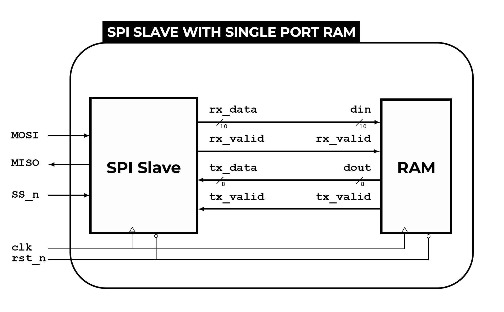

# SPI_Slave_with_Single_Port_RAM

## Description

This project implements an SPI (Serial Peripheral Interface) slave device with integrated single-port RAM, using Verilog. It enables efficient communication and data storage between a master device and the SPI slave. The repository includes testbenches for verifying functionality using QuestaSim and files for FPGA implementation in Vivado.

## SPI Wrapper



## Features

- **SPI Slave Interface**: Implements standard SPI protocol for serial communication.
- **Single-Port RAM**: Provides simple and efficient data storage.
- **Verilog Implementation**: Suitable for FPGA synthesis and simulation.
- **Testbenches**: Included for functional verification.
  
## SPI State Diagram

The state diagram for the SPI slave device is illustrated as follows:


### State Descriptions

- **IDLE**: The initial state where the SPI slave waits for communication. The state machine returns to IDLE on reset or when SS_n (Slave Select) is high.
  
- **CHK_CMD (Check Command)**: When SS_n is low, the SPI slave checks the command bit (MOSI). If MOSI is high, it transitions to READ_ADDR; if low, it transitions to WRITE.

- **WRITE**: In this state, the SPI slave writes the received address/data to RAM. The state persists as long as SS_n is low and transitions to IDLE when SS_n is high.

- **READ_ADDR**: When SS_n is low and MOSI is high, the SPI slave transitions to READ_ADDR to receive the address for reading from RAM.

- **READ_DATA**: In this state, the SPI slave sends the requested data from RAM to the master. The state persists as long as SS_n is low and transitions to IDLE when SS_n is high.
  
## Directory Structure

```
SPI_Slave_with_Single_Port_RAM/
├── RTL/                # Verilog source files
│   ├── SPI_spr_ram.v
│   ├── SPI_Slave.v
│   └── RAM.v
├── Verification/       # Testbench files and simulation scripts
│   ├── run_SPI_spr_ram.do
│   ├── SPI_spr_ram_tb.v
│   ├── src_files.list
│   └── mem.dat
├── Vivado_files/       # Files for FPGA implementation
│   ├── SPI_netlist.v
│   ├── SPI_spr_ram.xdc
│   ├── SPI_spr_ram.bit
│   └── project_1.edn
├── Documentation/      # Project documentation
│   └── Project_snippets.pdf
└── README.md           # This README file
```

## Signal Description

The following table describes the signals used in the design:

| Signal   | Direction | Width | Description                                    |
|----------|------------|-------|------------------------------------------------|
| MOSI     | Input      | 1     | Master Out Slave In                            |
| MISO     | Output     | 1     | Master In Slave Out                            |
| SS_n     | Input      | 1     | Slave Select (active low)                      |
| clk      | Input      | 1     | Clock signal                                   |
| rst_n    | Input      | 1     | Reset signal (active low)                      |
| rx_data  | Output     | 10    | Data received from SPI master                  |
| rx_valid | Output     | 1     | Indicates valid data received from SPI master  |
| tx_data  | Input      | 8     | Data to be transmitted to SPI master           |
| tx_valid | Input      | 1     | Indicates valid data to transmit to SPI master |
| din      | Output     | 10    | Data input to RAM                              |
| dout     | Input      | 8     | Data output from RAM                           |
| rx_valid | Output     | 1     | Data valid signal from SPI to RAM              |
| tx_valid | Input      | 1     | Data valid signal from RAM to SPI              |

## Getting Started

### Prerequisites

- ModelSim/QuestaSim for simulation
- Vivado/Quartus Prime for synthesis, place-and-route, and timing analysis

### Running Simulations

1. Clone the repository by typing the following command in your terminal
```bash
git clone https://github.com/amrelbatarny/SPI_Slave_with_Single_Port_RAM
```
2. Open ModelSim/QuestaSim

3. From the `File` menu, click on `Change directory` and navigate to the `Verification` directory

4. From the `Transcript` window run the following TCL command to run the script file
```tcl
do run_SPI_spr_ram.do
```


## Further Resources

The included documentation provides a detailed explanation of the design and implementation process (refer to `Documentation` / `Project_Snippets.pdf`).

## Contribution

We welcome contributions to this educational project. Feel free to submit pull requests for improvements or additional features.

## Contact

Click on the image below

<a href="https://beacons.ai/amrelbatarny" target="_blank">
  
</a> 
<br>
